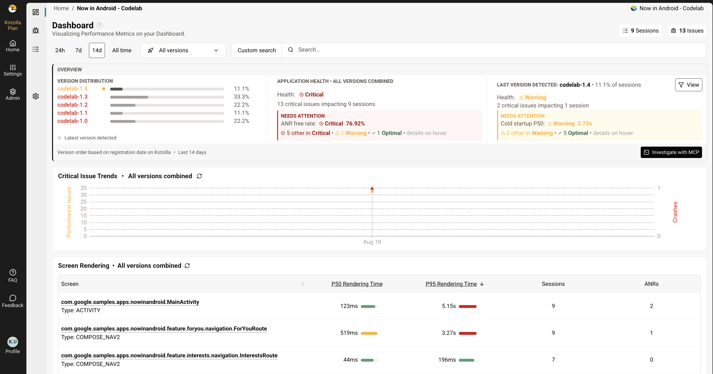

Kotzilla Codelab: Fix Now in Android
==================

> **A self-paced codelab by [Kotzilla](https://kotzilla.io)**. Do it at home, at your own pace.

This app is a version of Google's **[Now in Android](https://github.com/android/nowinandroid)** where
Dagger Hilt is replaced by **Koin** (Koin Compiler Plugin), instrumented with the **Kotzilla SDK**.
It ships with **intentionally planted performance and stability bugs**. Your mission: use the
**Kotzilla MCP server** and your AI assistant to detect them from real runtime sessions, root-cause
them, fix them, and prove it with a before/after report.

You do not need to hunt for the bugs in the code. That is the point: the Kotzilla Platform finds
them from what the app actually does at runtime, and your AI assistant fixes them with that
evidence.

The Hilt to Koin migration deep-dive lives in [`docs/KOIN_COMPILER_PLUGIN.md`](docs/KOIN_COMPILER_PLUGIN.md).

---

## Prerequisites

1. **Kotlin** intermediate level, plus basic Android, ViewModel/Lifecycle, and DI familiarity.
2. **Android Studio** with the Android SDK and a working **emulator or device**.
3. **Clone this repo and run ONE successful Gradle sync + build** before starting
   (`./gradlew :app:assembleDemoDebug`). Now in Android is a 30-module app; the first build is slow.
4. **Create a free [Kotzilla account](https://console.kotzilla.io/signup)**. You need it before
   anything else: both the MCP server and the platform authenticate against this account.
5. **Connect an MCP-capable AI assistant** (Claude Code, Cursor, Windsurf, Android Studio) to the
   Kotzilla MCP server. For Claude Code:

```bash
claude mcp add kotzilla --transport http https://mcp.kotzilla.io/mcp
```

   For other clients, see the [MCP setup guide](https://doc.kotzilla.io/docs/getstartedCustom/mcpSetup).
   On first use, the server opens a browser auth flow with the account from step 4.

---

## Step 1: Register the app through MCP

No SDK key is bundled. Ask your assistant to set it up for you, in your own words, for example:

> "Register this app on Kotzilla and configure the SDK."

The MCP server guides the assistant through app registration and returns a `kotzilla.json`; the
assistant pastes it into `app/`. The SDK and Koin libraries are already wired into the project.

## Step 2: Capture a "before" session

Build and install the app (`./gradlew :app:installDemoDebug`), then run this navigation path:

1. Launch the app from the launcher (cold start). The first launch shows a notification permission
   dialog; either choice is fine. Notice how long the app takes to show the feed: that slowness is
   real, and it is being measured.
2. On the **For You** screen, follow a topic and scroll the feed.
3. Open **Search** (the magnifier, top left) and search for "compose".
4. Open the **Saved** tab.
5. Open the **Interests** tab. The app crashes. 💥 That crash is part of the codelab.
6. **Relaunch the app** and let it load: this uploads the crashed session. Then send the app to the
   background (home button) or close it.
7. Wait about a minute for the session to be processed.

## Step 3: The "before" report

Ask your assistant:

> "Generate a Kotzilla report for this app, version codelab-1.0."

You get a **FAIL** report listing around a dozen detected issues: a crash, a slow cold start, an
ANR, slow screens, and blocking components. The exact count varies with your device and how you
navigated, so do not worry if you see a few more or fewer. If the report shows no data yet, wait
another minute and ask again.

**Take a screenshot of this report.** You will attach it when you complete the codelab.

## Step 4: Diagnose and fix, issue by issue

Work top-down: the crash first, then everything blocking startup.
For each issue: read what is going on, optionally look at it in the
[Kotzilla Console](https://console.kotzilla.io/) (issues view, screen details, session timeline),
then hand it to your assistant. The assistant pulls the dependency trees, timings, and stack traces
from your real session through MCP, finds the root cause, and edits the code.

**Expect the version to change as you go.** The MCP fix flow verifies each fix against a fresh
session, so after every fix your assistant bumps `versionName` in `app/build.gradle.kts`, rebuilds,
re-runs the app, and re-checks the issue on that new version. Let it. Intermediate names like
`codelab-1.1`, `codelab-1.2` are fine, whatever it picks.

The only thing that matters for completion is that your **last** build is the one with all the
fixes in it. Step 6 compares `codelab-1.0` against whatever version is newest, so the names in
between are yours to pick.

### 4.1 The crash: Interests tab

Tapping **Interests** makes Koin instantiate `InterestsViewModel`. Its construction throws, Koin
wraps the failure in an `InstanceCreationException`, and the app dies. This is a classic
crash-on-resolution: the failure surfaces in the DI container, and the captured stack trace names
the exact component. Kotzilla recorded it even though the app died, because the session is uploaded
on the next launch.

> "My app crashes when I open the Interests screen. Find the root cause with Kotzilla and fix it."

**What the fix looks like:** the ViewModel's constructor enforces a precondition that can never be
met, so construction always throws. The fix removes that check (or makes the configuration truly
optional) so the ViewModel can be created.

### 4.2 Startup: everything that blocks the first frame

The report shows a cold start above 10 seconds, an **ANR** and a slow screen on MainActivity, a
main-thread issue on `MainActivityViewModel`, and a background-thread issue on the sync worker.
That reads like five problems. It is three blocking components, all inside the startup window, and
one prompt usually clears the lot:

> "My cold startup is over 10 seconds. Find everything that blocks it and fix it."

Expect your assistant to fix all three in one pass, rebuilding and re-measuring as it goes. Each is
a distinct anti-pattern:

- **`Application.onCreate`** does synchronous work before any Activity can start. The most
  expensive place to be slow: every user pays it, every launch, before seeing anything.
- **`MainActivityViewModel`** takes ~5s to resolve on the main thread while the screen waits. The
  tell is in the dependency tree: its whole subtree costs single-digit milliseconds against a
  multi-second resolution, so the time is inside the constructor. A slow constructor, not a heavy
  graph. Past 4.5s of blocked rendering it also becomes an **ANR**. A ViewModel should expose state
  as a `StateFlow` and load in `viewModelScope`, never in its constructor.
- **The sync worker** (`androidx.work.ListenableWorker`) blocks ~2s while being created. It runs
  off the UI thread, so it is tempting to skip, but it starts from `Application.onCreate` and
  resolves inside the cold-start window. A `CoroutineWorker` does its work in `doWork`, and
  construction stays instant.

If your assistant stops after the first one, point it at the rest:

> "MainActivityViewModel is still blocking the main thread. Diagnose it with Kotzilla and fix it."

> "Now analyze the background thread issue on the sync worker and fix it."

### 4.3 One more, and this one is not ours

With the planted issues gone, the report still shows a **slow transition** of roughly 700ms on
`InterestsRoute`, and similar numbers on Search and Saved. We did not plant that one. It ships in
Now in Android today.

> "Now fix the slow transition on InterestsRoute."

The timeline tells it: the screen draws in ~11ms, then takes another ~700ms to reach `RESUMED`,
with nothing on the main thread in between. Three unrelated destinations landing on nearly the same
number is the clue that one shared cause is behind all of them.

**What the fix looks like:** `NavHost` defaults to a 700ms crossfade, and a destination is not
interactive until it finishes. Overriding `enterTransition`/`exitTransition` to 200ms gets the time
back. Note this is a real UX decision, not just a metric: the delay *is* the animation.

Optional. Leaving it does not count against your completion.

## Step 5: Capture the "after" session

1. In `app/build.gradle.kts`, bump `versionName` and `versionCode` one last time. The name does
   not matter, `codelab-2.0` is a fine choice. What matters is that this build is the newest one,
   so it is the one Step 6 compares against `codelab-1.0`.
2. Rebuild and install.
3. Run the Step 2 navigation path **twice** (this time Interests should not crash). Run it twice
   because the first launch after installing a new build is slower: the runtime is still compiling
   it, which inflates cold start by several seconds for reasons that have nothing to do with your
   code.
4. Background or close the app, then wait about a minute.

**If a run goes wrong, bump the version again and redo it.** A version is a permanent bucket:
every session ever recorded against it counts, so one bad run keeps affecting it and re-running on
the same version cannot undo that. Bumping costs nothing here, and the newest version is the one
that gets compared.

## Step 6: Check what you fixed

The check is a comparison: every issue that was in `codelab-1.0`, against your latest version.

> "On Kotzilla, take each issue from codelab-1.0 and tell me whether it is gone in my latest
> version, or how far it dropped."

Each issue records which versions it appeared on, so "gone" is a fact rather than a judgement.
Expect this:

| From `codelab-1.0` | Expected |
| --- | --- |
| Crash on the Interests screen | Gone |
| ANR on `MainActivity` | Gone |
| Slow screen on `MainActivity` (~5s) | Gone |
| Slow warm startup | Gone |
| `MainActivityViewModel` blocking the main thread (~5s) | Gone |
| `ListenableWorker` blocking a background thread (~2s) | Gone, or down to a few hundred ms |
| Cold startup (~15s) | Down to a few seconds. Usually still listed: an emulator crosses that threshold on its own. |

Read the last two rows as magnitudes. The rest should stop appearing.

Judge yourself on that table, not on the report's overall status, which grades the whole app
against absolute thresholds and stays FAIL on an emulator whatever you do. Two other entries may
appear that you did not cause: a slow `ForYouRoute` on a launch whose database was still filling
for the first time, and `okhttp3.Call$Factory` on a background thread, visible only because your
app is now fast enough to reach image loading inside the measured window. 🎉

**Take a screenshot of that comparison.** It is what you send in.

The same story is visible in the [Kotzilla Console](https://console.kotzilla.io/). Open the
**Dashboard** and use the version filter to move between `codelab-1.0` and your final version, or
just read the two panels side by side: the app across all versions against the latest one on its
own.



Every version you built along the way is listed, and the health of the newest one is reported
separately from the app as a whole. The screen table underneath is the same data Step 6 compares,
per screen, with ANR counts.

## Completing the codelab

Email **codelab@kotzilla.io** with:

- your **app name** as registered on Kotzilla,
- the **name of your final version**,
- the Step 3 "before" screenshot and the Step 6 comparison screenshot.

We check the rest server-side, against the same table in Step 6 and nothing else. Every completer
gets a shout-out, and completions enter a prize draw.

---

## What you practiced

- Registering an app and configuring an SDK entirely through MCP.
- Turning runtime symptoms (a crash, a slow start, an ANR, frozen screens, background stalls,
  slow transitions) into component-level evidence with the Kotzilla Platform.
- Letting an AI assistant fix issues from real dependency graphs and session timings instead of
  guessing from code.
- Proving a fix with version-scoped before/after reports, the same mechanism you would use as a
  release gate in CI.

---

# License

**Now in Android** is distributed under the terms of the Apache License (Version 2.0). See the
[license](LICENSE) for more information. Original project readme: [`README.original.md`](README.original.md).
